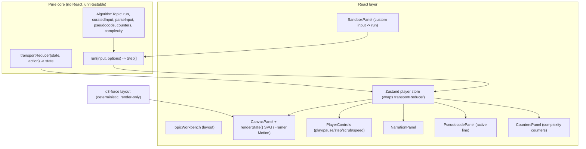

# M1: Shared visualization and walkthrough framework (design)

Status: approved for build (orchestrator-directed, autopilot)
Issue: kelvinxxle/algoviz#5
Source of truth: `docs/prd.md`, `docs/tech-stack.md`, `docs/design/dijkstra/`

## 1. Goal

Build the single reusable engine that all ten topics and the future AI explainer
reuse, then prove it end to end on Dijkstra. The highest-stakes decision is the
public authoring contract: the `Step` shape and the `run()` signature. Nine future
topics plug into it, so it is designed to be minimal, complete, strictly typed, and
documented.

## 2. Architecture



Key boundary: the algorithm core imports no React and no DOM. It is a set of pure
functions asserted frame by frame in Vitest. Rendering, layout math (d3), and
transport timing live in the React layer on top.

## 3. The public contract (`src/engine/contract.ts`)

```ts
// Renderer-agnostic emphasis category. The topic renderer maps each role to a
// visual treatment (color, glow, stroke).
export type HighlightRole =
  | "active"     // element being processed this frame
  | "candidate"  // being considered / relaxed this frame
  | "visited"    // settled / finalized
  | "frontier"   // in the queue / frontier
  | "path"       // part of the result path
  | "rejected"   // considered and discarded
  | "muted";     // de-emphasized

// One emphasis directive. `target` is an opaque, namespaced element id such as
// "node:A" or "edge:A->B". Each topic renderer owns the id convention.
export interface Highlight {
  readonly target: string;
  readonly role: HighlightRole;
}

// Live counter values for this frame, keyed by counter id. Display metadata
// (label, description, order) lives on the topic, not in every frame.
export type Counters = Readonly<Record<string, number>>;

// One frame of a visualization, generic over the topic's state snapshot.
export interface Step<TState> {
  readonly state: TState;                    // full snapshot to render this frame
  readonly narration: string;                // teaching text for this frame
  readonly highlights: readonly Highlight[]; // element emphasis directives
  readonly counters: Counters;               // complexity counters this frame
  readonly line?: number;                    // active pseudocode line, 1-based
  readonly caption?: string;                 // short label for the scrubber
}

// Options passed to run(). Kept minimal; reserved for sandbox safety + future use.
export interface RunOptions {
  readonly maxSteps?: number; // safety cap for pathological sandbox inputs
}

// THE authoring contract every algorithm implements.
export type Run<TInput, TState> = (
  input: TInput,
  options?: RunOptions,
) => Step<TState>[];

// Display metadata for one counter.
export interface CounterDef {
  readonly key: string;
  readonly label: string;
  readonly description: string;
}

// Validated parse result for sandbox input.
export type ParseResult<T> =
  | { readonly ok: true; readonly value: T }
  | { readonly ok: false; readonly error: string };

// A complete, framework-agnostic topic definition (no React import).
export interface AlgorithmTopic<TInput, TState> {
  readonly slug: string;
  readonly run: Run<TInput, TState>;
  readonly curatedInput: TInput;                       // the guided walkthrough
  readonly parseInput: (raw: string) => ParseResult<TInput>; // sandbox entry
  readonly serializeInput: (input: TInput) => string;  // prefill the sandbox box
  readonly pseudocode: readonly string[];              // static, 1 line per entry
  readonly counters: readonly CounterDef[];            // display metadata
  readonly complexity: { readonly time: string; readonly space: string };
}
```

### Why these shapes

| Decision | Rationale |
|----------|-----------|
| `Step<TState>` generic | Each topic has a different state (graph, DP table, trie). Generics give strict per-topic typing while the Player works over `Step<unknown>`. |
| `state` = full snapshot | A frame is self-contained; scrubbing to any index renders without replaying. |
| `highlights` opaque ids + closed role set | Renderer-agnostic. One array emphasizes nodes, edges, cells uniformly. The shared panels never parse topic semantics. |
| `counters` data-only, metadata on topic | Frames stay tiny; display config is static and authored once per topic. |
| `line` first-class | Every topic page shows pseudocode; highlighting the active line is core to the teaching model (confirmed by the Dijkstra mockup). |
| Static graph NOT in every step | Topology is constant; renderer reads it from `input`. Avoids duplicating the graph in every frame. |
| Positions are render-only | `run` uses pure topology; layout (d3) is a presentation concern, so the core stays deterministic and node-test friendly. |

## 4. Transport reducer (`src/engine/transport.ts`)

```ts
export interface TransportState {
  readonly stepCount: number;
  readonly index: number;    // clamped to [0, stepCount-1]
  readonly playing: boolean;
  readonly speed: number;    // steps per second; one of SPEEDS
}

export type TransportAction =
  | { type: "load"; stepCount: number } // new run(); resets index to 0, pauses
  | { type: "play" }
  | { type: "pause" }
  | { type: "toggle" }
  | { type: "next" }                    // pauses; clamps at last
  | { type: "prev" }                    // pauses; clamps at first
  | { type: "seek"; index: number }     // scrub; clamps; pauses
  | { type: "setSpeed"; speed: number }
  | { type: "reset" }                   // index 0, paused
  | { type: "tick" };                   // playback advance; auto-pauses at end

export function transportReducer(
  state: TransportState,
  action: TransportAction,
): TransportState;
```

Pure and exhaustively unit tested (clamping, auto-pause at end, speed changes,
reload). The Zustand store is a thin wrapper that dispatches into this reducer; a
`usePlayer` hook runs the playback clock and dispatches `tick`.

## 5. Dijkstra reference (`src/topics/dijkstra/`)

```ts
export interface GraphNode { readonly id: string; readonly x?: number; readonly y?: number; }
export interface GraphEdge { readonly from: string; readonly to: string; readonly weight: number; }
export interface DijkstraInput {
  readonly nodes: readonly GraphNode[];
  readonly edges: readonly GraphEdge[];
  readonly source: string;
  readonly target?: string;
  readonly directed?: boolean; // default false
}
export interface DijkstraState {
  readonly distances: Readonly<Record<string, number | null>>; // null = infinity
  readonly previous: Readonly<Record<string, string | null>>;
  readonly visited: readonly string[];
  readonly frontier: readonly { readonly id: string; readonly dist: number }[];
  readonly current: string | null;
  readonly relaxing: { readonly from: string; readonly to: string } | null;
  readonly path: readonly string[] | null; // shortest path to target when known
}
```

- `run(graph)` performs Dijkstra over pure topology and emits a frame at each
  meaningful event: init, extract-min, each relaxation (improved or rejected),
  settle, and final path. Deterministic tie-break by node id.
- Counters: `settled`, `relaxations`, `pqPushes`, `pqPops`.
- Oracle tests: final distances and path equal hand-computed values on the curated
  graph; running twice is deep-equal (determinism); rejects negative weights.
- Sandbox format: edge list, one `from to weight` per line, plus `source: X` and
  optional `target: Y`. Validates ids, non-negative numeric weights (negative is a
  documented Dijkstra pitfall and a clear error), and that source exists.
- Layout: curated input carries explicit positions to match the mockup. Sandbox
  graphs get deterministic positions from `d3-force` (render-only helper).

## 6. UI composition

`/topics/dijkstra` upgrades from the M0 stub to the real experience using the
IDE three-panel layout from the mockup:

| Region | Component | Driven by |
|--------|-----------|-----------|
| Center canvas | `DijkstraGraph` SVG (React + Framer Motion) | current `Step.state` + `highlights` |
| Center bottom | `PlayerControls` | transport store |
| Right tab: logic | `PseudocodePanel` + `NarrationPanel` | `step.line`, `step.narration` |
| Right tab: metrics | `CountersPanel` + complexity | `step.counters`, topic metadata |
| Sandbox | `SandboxPanel` | `parseInput` -> `run` -> store reload |

Walkthrough = `run(curatedInput)`; sandbox = `run(parseInput(userInput))` through
the exact same engine, so "show, then let me drive" falls out for free.

## 7. Dependencies to add

| Package | Use |
|---------|-----|
| `zustand` | transport store |
| `framer-motion` | declarative SVG transitions |
| `d3-force` + `@types/d3-force` | deterministic auto-layout for sandbox graphs (layout math only) |

## 8. Scope boundary

Build the framework plus Dijkstra only. Do not author the other nine topics and do
not build the AI explainer (M11). The engine is designed so they slot in later: a
new topic is just another `AlgorithmTopic<TInput, TState>` plus a renderer. The AI
explainer panel area is left as a clearly marked placeholder, no fabricated output.

## 9. Testing strategy (TDD: RED -> GREEN -> REFACTOR)

| Layer | Test |
|-------|------|
| `run` algorithm | oracle distances/path, frame events, determinism, negative-weight rejection, disconnected nodes |
| counters | exact counts on curated graph |
| `parseInput` | valid parse, malformed lines, negative weight, missing source |
| `transportReducer` | clamping, auto-pause, speed, load/reset |
| layout helper | deterministic positions (same input -> same output) |
| components | NarrationPanel, PseudocodePanel, CountersPanel, PlayerControls render from a step/store |
| e2e (Playwright) | walkthrough play/pause/step/scrub/speed; sandbox custom input re-runs |

## 10. Verification gate (before reporting done)

`format:check`, `lint`, `typecheck`, `test` (unit), `build`, `test:e2e`, `npm audit`.
No "done" claim without all green.
