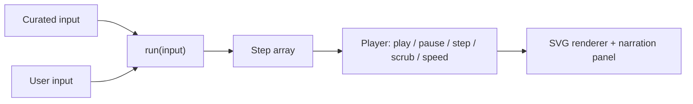
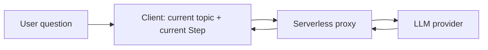

# Tech Stack

Source of truth: [`docs/prd.md`](./prd.md). Every choice here traces back to it.

AlgoViz is a flat, browsable library of 10 locked topics. Each topic page is a guided
narrated walkthrough on a curated example, then the same engine re-run on the user's own
input, plus a topic-scoped AI explainer. No accounts, no progress, no progression.

The central technical bet: every topic reuses one shared visualization and walkthrough
framework. Build that once, prove it on a reference topic, then each remaining topic is
mostly authoring (a step generator, an input schema, and page content).

---

## Recommended defaults

| Layer | Recommended default | Why |
|-------|--------------------|-----|
| Language | TypeScript | Shared visualization abstractions need types to stay safe as topics grow |
| Framework | React + Vite (SPA) | No accounts, SEO, or SSR needs; a flat client library is simplest as a SPA, and Vite gives fast dev |
| Rendering | SVG via React | Crisp, inspectable, accessible; scales to graphs, trees, grids, and bit-arrays without a game engine |
| Animation | Framer Motion (motion) | Declarative animated transitions on SVG and DOM that fit React's model |
| Layout math | D3 utilities only (d3-hierarchy, d3-force, d3-scale) | Use D3 to compute layouts, not to own the DOM, so React stays the renderer |
| Styling | Tailwind CSS | Fast and consistent, suits a clean single-focus surface |
| Transport state | Zustand | Tiny store for player state (index, playing, speed) shared across panels |
| Routing | React Router | Flat routes: `/` and `/topics/:id` |
| AI explainer backend | Serverless function (Vercel Functions) | Keeps the LLM key off the client; same platform hosts the static site |
| Hosting | Vercel | Static SPA plus serverless functions plus env-secured keys in one place |
| Tooling | pnpm, ESLint, Prettier, Vitest + React Testing Library, Playwright (E2E) | Standard and fast; covers unit tests and transport end-to-end |

---

## Core architecture: algorithm as a step generator

Every topic implements one pure function:

```
run(input, options) -> Step[]
```

A `Step` is a snapshot frame:

```
Step = {
  state,         // the data structure at this frame (graph, grid, tree, ring, bitset, ...)
  highlights,    // what to emphasize (active node, compared cells, pointer positions)
  narration,     // the line shown for this step
  counters,      // complexity counters (comparisons, ops) for the "why it costs" story
}
```

This single abstraction makes the PRD's "show, then let me drive" fall out for free:



- Walkthrough = `run(curatedInput)` with authored narration.
- Sandbox = `run(userInput)` through the exact same engine and player.
- The renderer, transport, narration panel, and complexity counter are written once in the
  framework and reused by all 10 topics. Each topic supplies only its `run` function, an
  input schema, and a small topic-specific view.

This is the most reused abstraction in the product and is built and proven first (see the
milestone roadmap).

---

## Scoped AI explainer

A thin serverless function proxies to an LLM provider behind an interface. The client
assembles context from the current topic metadata and the current `Step`, then posts
`{ topicId, stepContext, userQuestion }`. The function holds the provider key and returns
the answer. Scope is enforced by sending only the current topic and step context, so the
explainer stays anchored to "this topic, this step" as the PRD requires.



---

## Alternatives considered

| Decision | Alternative | Trade-off |
|----------|-------------|-----------|
| React + Vite SPA | Next.js | Adds SSR/edge and co-located API routes, but more framework weight than a no-account SPA needs |
| React + Vite SPA | SvelteKit | Lean and great for animation, but smaller ecosystem and less common familiarity |
| SVG + Framer Motion | Pure D3 | Powerful but imperative, and fights React for DOM ownership |
| SVG + Framer Motion | Canvas / PixiJS | Only needed for very large node counts; overkill at this scale and harder to make accessible |
| SVG + Framer Motion | React Flow | Good for node-graphs, but opinionated and weak for grids, bit-arrays, and custom visuals |
| Vercel Functions | Cloudflare Workers / Netlify Functions | Comparable; pick by cost and edge preference |
| Vercel Functions | Dedicated Node/Express backend | More control, but more ops overhead than this product warrants |
| Tailwind | CSS Modules / vanilla-extract | Workable, but slower to build a consistent design surface |

---

## Milestone roadmap

Sequenced so the shared framework is built and proven first, then topics are mostly
authoring, then the AI layer, then polish.

| # | Milestone | One-line scope |
|---|-----------|----------------|
| M0 | Foundation and app shell | Vite + React + TS + Tailwind + routing + lint/test + CI; flat topic-library landing showing all 10 topics (9 as locked/coming-soon) |
| M1 | Shared visualization and walkthrough framework | Step model, Player transport (play/pause/step/scrub/speed), narration panel, highlight system, complexity counter, custom-input harness; proven end to end on Dijkstra as the reference vertical slice |
| M2 | Topic: Dynamic Programming | Grid-based overlapping-subproblems walkthrough + custom input + page content |
| M3 | Topic: Union-Find | Connectivity with path compression; forest visualization + custom input + content |
| M4 | Topic: Backtracking | Recursion tree with pruning; walkthrough + custom input + content |
| M5 | Topic: Tries | Prefix tree behind autocomplete; walkthrough + custom input + content |
| M6 | Topic: Bloom Filters | Bit-array probabilistic membership; walkthrough + custom input + content |
| M7 | Topic: Consistent Hashing | Hash ring and reshuffle-avoidance; walkthrough + custom input + content |
| M8 | Topic: LRU Cache | Eviction in motion; walkthrough + custom input + content |
| M9 | Topic: B-Trees | Node splits and index structure; walkthrough + custom input + content |
| M10 | Topic: Rate Limiting | Token bucket and sliding window; walkthrough + custom input + content |
| M11 | Scoped AI explainer | Serverless LLM proxy + topic/step-scoped chat UI on every topic page |
| M12 | Polish, accessibility, deploy | Responsive, a11y for the player, perf, empty/error states, production deploy |

Notes:
- Dijkstra is folded into M1 as the reference topic that proves the framework, so it is not
  a separate milestone.
- Topic milestones (M2 to M10) are independent once M1 lands, so they can run in parallel
  across sessions, one session per milestone.
- Topic order after the framework is flexible; the library is flat, so any order works.
