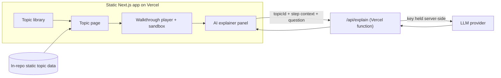

# Tech Stack

Source of truth: [`docs/prd.md`](./prd.md). Visual direction: [`docs/design/`](./design/)
("Deep Midnight" palette and per-screen mockups). Every choice traces back to those.

## Optimization priorities (in order)
1. Speed to ship
2. Familiarity, weighted against the user's known stack from swing-analyzer:
   Next.js/React + TypeScript, Python/FastAPI, Vercel + Render, pytest/vitest
3. Low ops overhead

---

## Summary (recommended defaults)

| Layer | Recommendation | One-line reason |
|-------|----------------|-----------------|
| Frontend | Next.js (App Router) + React + TypeScript | Known stack; its Route Handlers absorb the only server need, so no separate backend |
| Styling | Tailwind CSS + CSS-variable theme | Mockups are already Tailwind; realizes Deep Midnight tokens fastest |
| Visualization | SVG rendered by React | Mockups use SVG; crisp, inspectable, accessible, no game engine |
| Animation | Framer Motion + d3 layout utilities | Declarative transitions in React; d3 for layout math only |
| Player state | Zustand | Tiny store for transport (index, playing, speed) shared across panels |
| Backend | One Next.js Route Handler (serverless) for the AI explainer | The only server-side need is hiding the LLM key |
| Database | None for v1 | No accounts, no progress, no persistence in the PRD |
| Hosting | Vercel only | One platform hosts the static app and the serverless function |
| Testing | Vitest + React Testing Library + Playwright | Known frontend test stack; Playwright covers the player E2E |

Lead recommendation in one line: ship a **Next.js + TypeScript app on Vercel, no database,
no separate backend**, with the scoped AI explainer as a single serverless Route Handler.

---

## Is each layer even needed?

The PRD has no accounts, no progress tracking, and no persistence. That removes most of a
conventional stack. Being honest about each layer:

| Layer | Needed in v1? | Verdict |
|-------|---------------|---------|
| Database | No | Topic content and curated examples are authored in-repo and shipped as static data. Custom input is ephemeral and runs entirely client-side. Nothing to persist. |
| Backend service | Barely | The only server-side requirement is keeping the LLM key off the client for the AI explainer. That is one stateless proxy endpoint, not a service. |
| Frontend | Yes | The whole product is the client: the library, the walkthrough player, and the sandbox. |
| Hosting | Yes | Static assets plus one serverless function. |

### The real trade-off: serverless function vs full backend

| Option | What it is | Speed | Familiarity | Ops | Verdict |
|--------|-----------|-------|-------------|-----|---------|
| A. Next.js Route Handler (recommended) | The AI proxy lives in the same Next.js app as `app/api/explain/route.ts`, deployed as a Vercel function | Fastest: one repo, one deploy, one language | High: Next.js + TS + Vercel are all in the known stack | Lowest: nothing extra to run | Pick this |
| B. Separate FastAPI service on Render | A standalone Python service hosts the proxy | Slower: second repo/deploy, CORS, cold starts | Highest on language (Python/FastAPI/Render are known) | Higher: a second platform and service to operate for one endpoint | Keep one step away |

Option B maximizes backend-language familiarity, but for a single stateless endpoint it adds
a whole second deploy target and ongoing ops for no functional gain. Speed to ship and low
ops (priorities 1 and 3) outweigh the Python familiarity here, and Next.js + Vercel are
themselves familiar. If the AI layer later grows real server logic (caching, rate limiting,
multiple providers, heavier orchestration), promoting it to a FastAPI service on Render is a
clean, low-regret move.

---

## Architecture (v1)

No database. No separate backend. One function, one host.

---

## Layer-by-layer detail

### Frontend: Next.js (App Router) + React + TypeScript
- **Why default:** It is the user's known frontend, and its Route Handlers let the one
  server need (the AI proxy) live inside the same app. That collapses "frontend + backend"
  into a single project and a single deploy, which is the fastest path to ship.
- **Mostly static:** Pages are prerendered. There is no SSR data dependency because there
  is no per-user state. The app behaves like a static site with one dynamic API route.
- **Trade-off vs a pure SPA:** A Vite SPA plus a standalone serverless function is also
  viable and slightly leaner at runtime, but it splits config across two tools and is a
  less familiar pairing than Next.js. Kept one step away.
- **Alternative:** Vite + React SPA (leaner, but two configs and a separate function).

### Styling: Tailwind CSS with a CSS-variable theme
- **Why default:** The `docs/design/` mockups are already authored in Tailwind, so matching
  them is fastest. The Deep Midnight palette maps cleanly to CSS variables exposed as
  Tailwind theme tokens (`surface`, `primary`, `secondary`, `outline`, and so on).
- **Realizing Deep Midnight:** 0px radius by default, 1px solid borders instead of shadows,
  tonal surface layers, Geist for UI text and JetBrains Mono for data/code. All express
  directly as Tailwind tokens and utilities.
- **Player layout:** The Dijkstra mockup is an IDE-style three-panel grid (left topic nav,
  central SVG canvas with playback controls, right detail panel). Tailwind's grid utilities
  and 1px-border tiling match that "fixed grid" brutalist layout with little custom CSS.
- **Alternative:** CSS Modules or vanilla-extract (typed, scoped, but more boilerplate to
  reproduce the token system and to re-derive the mockups).

### Visualization: SVG rendered by React
- **Why default:** The mockups draw the graph and bit-array views in SVG. SVG is crisp at
  any zoom, inspectable, accessible, and integrates with React as plain elements. It comfortably
  covers every v1 topic: graphs, trees, grids, hash rings, and bit arrays.
- **Animation:** Framer Motion for declarative enter/exit/transition on SVG and DOM. Use d3
  utilities (`d3-hierarchy`, `d3-scale`, `d3-force`) for layout math only, not DOM control,
  so React stays the single renderer.
- **Alternative:** Canvas or PixiJS, only if a future topic needs thousands of moving nodes.
  Overkill at this scale and harder to make accessible. Kept one step away.

### The "walkthrough then custom input" model
- Each topic is one pure function `run(input) -> Step[]`. A `Step` is a frame:
  `{ state, highlights, narration, counters }`.
- A shared Player (play / pause / step / scrub / speed) renders any step sequence.
- Walkthrough = `run(curatedInput)`; sandbox = `run(userInput)` through the same engine.
  "Show, then let me drive" falls out for free, and this engine is built once and reused by
  all 10 topics.

### Player state: Zustand
- A small store for transport state (current index, playing, speed) shared between the
  canvas, controls, narration panel, and AI explainer. Lighter than Redux, simpler than
  threading context everywhere.
- **Alternative:** React context + `useReducer` (fine, but more wiring as panels grow).

### Backend: one Next.js Route Handler for the AI explainer
- `app/api/explain/route.ts` receives `{ topicId, stepContext, userQuestion }`, attaches the
  provider key server-side, calls the LLM behind a small provider interface, and returns the
  answer. Scope is enforced by sending only the current topic and step context.
- **Alternative:** Standalone FastAPI service on Render (see the trade-off table above).

### Database: none
- Nothing in v1 needs persistence. Topic definitions, curated examples, and narration are
  authored in-repo as typed data and shipped with the build. If a future feature (saved
  progress, community topics) needs storage, add it then; it is not load-bearing now.

### Hosting: Vercel only
- The static app and the one serverless function deploy together on Vercel, with the LLM key
  in an environment variable. No second platform to operate, which keeps ops at a minimum.
- **Alternative:** Add Render only if the backend is promoted to a standalone FastAPI service.

### Testing: Vitest + React Testing Library + Playwright
- Vitest + React Testing Library for unit and component tests, including each topic's `run`
  step generator (pure functions are easy to assert frame by frame). This matches the known
  vitest workflow.
- Playwright for end-to-end coverage of the walkthrough player (play, pause, step, scrub) and
  the sandbox custom-input flow.
- **pytest** enters only if the FastAPI backend alternative is chosen.

---

## What this buys against the priorities
- **Speed to ship:** one repo, one language, one deploy, no database, no second service.
- **Familiarity:** Next.js + React + TypeScript + Vercel + vitest are all from the known
  stack; the FastAPI/Render/pytest path stays one documented step away.
- **Low ops:** a static app plus a single function on one host, with nothing stateful to run,
  back up, or scale.
